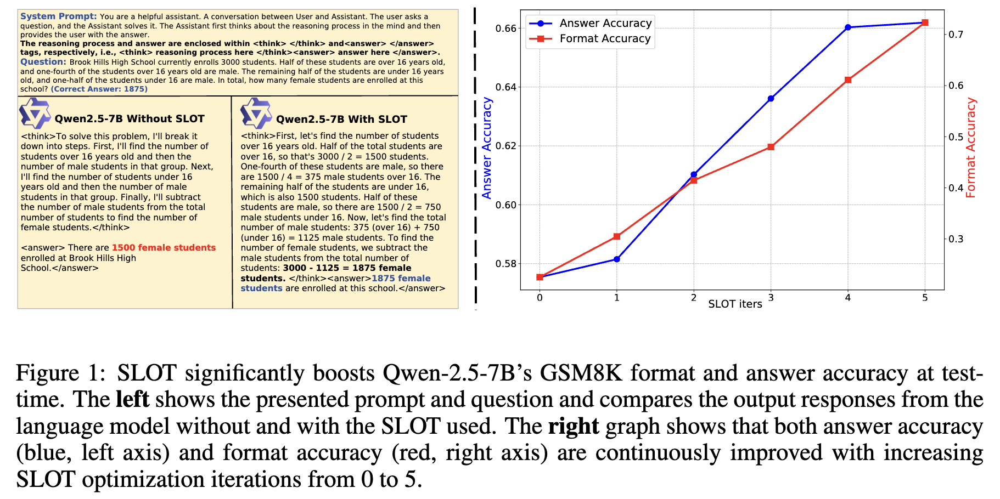

# SLOT: Sample-specific Language Model Optimization at Test-time

***Training free, simple but effective***
___Training free, simple but effectiv___

***Fast, low overhead, easy to adapt to your reasearch***

This script evaluates a language model on the GSM8K benchmark, comparing its baseline performance against its performance when enhanced with SLOT (Sample-specific Language Model Optimization at Test-time).

SLOT is a test-time inference technique that optimizes a lightweight, sample-specific parameter vector for a few steps on the input prompt. This helps the model better align with and follow the given instruction.

SLOT pipeline


SLOT results



## Prerequisites

- Python 3.10.15
- torch==2.5.1
- transformers==4.49.0.dev0
- datasets==3.2.0

## Usage


2.  **Run the SLOT**:
    Execute the script from your terminal (change the model_path):
    ```bash
    bash run.sh  ## baseline and SLOT(iters=5)
    ```

## How it Works

1.  **Baseline Evaluation**:
    - `times` environment variable is set to `0`.
    - This run measures the model's performance without SLOT optimization.

2.  **SLOT-Enhanced Evaluation**:
    - `times` environment variable is set to a value > 0 (e.g., `5` in the script). This controls the number of optimization iterations for SLOT.
    - `lr` environment variable is set (e.g., `0.1` in the script). This is the learning rate for the SLOT optimization.
    - This run measures the model's performance with SLOT applied.

## Configuration

The primary configurations are within `run.sh`:

-   `model_path`: (Required) Path to the pre-trained model.
-   `times`: Number of optimization iterations for SLOT. `0` for baseline.
-   `lr`: Learning rate for SLOT optimization.

The `eval_only_slot.py` script uses these environment variables to control its behavior. You can modify them directly in `run.sh` to experiment with different SLOT settings.

## Output

-   **Log Files**: Detailed logs for each run, including per-sample information, are saved in the `logs/` directory. The log file names are formatted as `log_times_<times_value>_lr_<lr_value>.txt`.
    For example:
    - `logs/log_times_0_lr_0.1.txt` (Baseline, assuming lr is still set but times=0 makes it irrelevant for SLOT opt)
    - `logs/log_times_5_lr_0.1.txt` (SLOT with 5 iterations)
 
## Contact
If you have any problem, welcome issues, or contact Yang Hu (Email: huyangtorus@gmail.com, Wechat: 18840249731)

