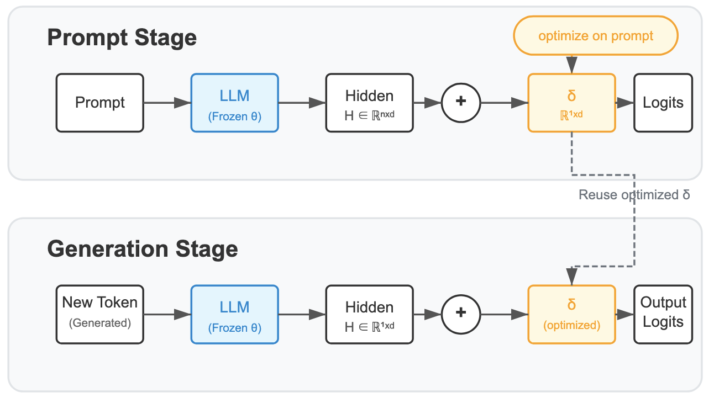

# SLOT: Sample-specific Language Model Optimization at Test-time

***Training free, simple but effective test-time adaptation***

***Fast, low overhead, easy to adapt to your reasearch***

SLOT is a test-time inference technique that optimizes a lightweight, sample-specific parameter vector for a few steps on the input prompt. This helps the model better align with and follow the given instruction.


## How it works?
The goal of the proposed SLOT approach is to adapt the trained LM to individual prompts at test-time. When a prompt is given, SLOT generates a response with two phases.
- First, in the *Prompt Stage* we seek to learn a sample-specific **light-weight** vector $\delta\in\mathcal{R}^{1\times d}$ that can be directly added on the final hidden features $H$ from the LLM without incuring heavy computing overhead.
- Second, in the *Generation Stage*, we apply $\delta$ to the final hidden features $H$ for the next-token prediction to generate a complete response with the test-time adapted $\delta$.



## Getting Started

### Prerequisites

- Python 3.10.15
- torch==2.5.1
- transformers==4.49.0.dev0
- datasets==3.2.0
- vllm==0.7.2

### Inference

We provide the inference code [eval_only_slot.py](eval_only_slot.py) to evaluate models on [GSM8k](https://huggingface.co/datasets/openai/gsm8k). If you would like to inference with other prompts, feel free to modify the code!

```bash
export times=[NUM OF OPTIMIZATION ITERS IN SLOT]
export lr=[LEARNING RATE USED IN SLOT]

python eval_only_slot.py \
    --model_path [PATH_TO_MODEL_WEIGHTS]
```

Hyper-parameters in SLOT are set with environment variables. If `times=0` is set, then the model is inferenced without SLOT optimzation.

Please refer [run.sh](run.sh) for example commands.

Output logs are saved in `logs/log_times_<times_value>_lr_<lr_value>.txt`.

### SLOT for LLM on Various Benchmarks

1. Pre-saving `lm_head`
SLOT operates on the final projection layer (`lm_head`) of the Transformer and requires Tensor Parallelism (TP) for large models.  
To prepare, first extract and save the `lm_head` from the model's weights.
📄 Refer to [`retrieve_lm_head.ipynb`](./retrieve_lm_head.ipynb) for detailed instructions.
2. Replace `model_runner.py` in `vllm`
To enable SLOT within the `vllm` inference framework, replace the original `model_runner.py` file:
```bash
cp ./vllm/model_runner.py ~/openr1/lib/python3.11/site-packages/vllm/worker/model_runner.py
```
3. Run Inference with SLOT
Execute the following script to launch inference with SLOT support:
```shell
bash run_vllm.sh
```

## SLOT results


## Contact
If you have any problem, welcome issues, or contact Yang Hu (Email: huyangtorus@gmail.com, Wechat: 18840249731)

